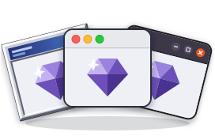

<p align="center">
  
</p>

# tryst

Tcl/Tk bindings for Crystal, with a declarative UI DSL on top.

Tryst builds real desktop apps — native widgets, menus, dialogs, canvases —
from plain Crystal, compiled to a single binary, with Tcl/Tk as the only
system dependency.

> [!WARNING]
> **Early development. Alpha quality. Expect breaking changes.**
> This is a monorepo of shards under active, early development. Things
> may change — including public APIs — commit-to-commit without notice.
> No tagged version yet. It's developed and tested on macOS (Aqua) and
> Linux (X11), with a full spec suite on Tcl/Tk 8.6 and 9.x, but nothing
> has shipped as a release. Pin a commit if you need stability. Built
> with AI assistance.

```crystal
require "tryst/ui"

clicks = 0

Tryst::UI.app(title: "Counter") do |ui|
  message = ui.var("no clicks yet")

  ui.column do
    ui.label(bind: message)
    ui.button(text: "Click me").on_action do
      clicks += 1
      message.value = "clicked #{clicks} time#{clicks == 1 ? "" : "s"}"
    end
  end
end.run
```

## Requirements

- Crystal >= 1.21.0
- Tcl/Tk 8.6 minimum (9.x also supported, see Tests below)
- Windows: Crystal and Tcl/Tk both come from MSYS2, not their usual installers

See [INSTALL.md](INSTALL.md) for per-platform setup.

## Installation

```yaml
dependencies:
  tryst:
    github: jamescook/tryst
```

## The UI DSL

`Tryst::UI.app` yields a builder. Everything declared in the block is a plain
tree, and the window is created and shown in one step by `run`. Because
building the tree never touches Tcl/Tk, your UI structure can be constructed
and inspected in specs without a display.

Widgets are the ones you'd expect: `button`, `label`, `text_box`,
`text_area`, `checkbox`, `radio`, `dropdown`, `slider`, `number_box`,
`progress`, `list`, `tree`, `table`, `canvas`. Containers arrange them:
`column`, `row`, `grid`, `panel`, `group`, `tabs`, `split`, `scrollable`,
and `window` for additional toplevels. Lists, tables, text areas and
trees attach their own scrollbars automatically.

A grid places widgets by cell, and `stretch` names which rows or columns
absorb resize:

```crystal
Tryst::UI.app(title: "Login") do |ui|
  user = ui.var("")
  pass = ui.var("")

  ui.grid(gap: 4) do
    ui.cell(row: 0, col: 0) { ui.label(text: "User") }
    ui.cell(row: 0, col: 1, sticky: :ew) { ui.text_box(bind: user) }
    ui.cell(row: 1, col: 0) { ui.label(text: "Password") }
    ui.cell(row: 1, col: 1, sticky: :ew) { ui.text_box(bind: pass, show: "*") }
    ui.cell(row: 2, col: 1, sticky: :e) do
      ui.button(text: "Sign in").on_action { authenticate(user.value, pass.value) }
    end
    ui.stretch(columns: [1])
  end
end.run
```

### Reactive variables

`ui.var` declares a value that widgets bind to with `bind:`. Set
`var.value` from code and every bound widget updates; type into a bound
`text_box` and `var.value` reflects it. This is the seam that keeps
application logic out of the UI: a service publishes changes, the UI
subscribes and pushes them into a var
([`examples/calculator_ui/`](examples/calculator_ui/) is a complete worked
example of the split — its service runs in specs with no interpreter at
all).

### Names and handles

Every widget method returns a handle, and widgets can be named:

```crystal
ui.button(:save, text: "Save")
# later, from anywhere with the session in scope:
ui[:save].configure(state: :disabled)
```

Handles configure, show/hide, destroy, and wire events after the fact
(`on_action`, `on_close`, key and mouse bindings).

### Timers, dialogs, and the rest

The session carries the app-level conveniences: `every(ms)` and
`after(ms)` timers (declarable right inside the build block), native file
open/save dialogs, `message`, `choose_color`, `choose_dir`, a `toast` for
transient feedback, a `busy` cursor block, and clipboard access. UIs that
grow at runtime append validated subtrees with `add`.

### Concurrency

Three lanes, picked by what the work is waiting on: a plain `spawn`
fiber for socket IO, `App#off_thread` for File/DNS/TLS calls, and
`Tryst::BackgroundWork` for CPU-bound work. See
[CONCURRENCY.md](CONCURRENCY.md) for which lane to pick, the one rule
that holds across all of them, and a macOS-specific gotcha around
File/DNS/TLS calls.

### Validation

The tree is checked before anything reaches Tk: a `cell` outside its
grid, two widgets in one cell, a `tab` outside `tabs` — these raise a
`ValidationError` naming the offending widgets at `run`, rather than
surfacing later as a cryptic Tcl error.

## The escape hatch

The DSL is sugar over tryst, not a wall around it. Anything it doesn't
spell yet is one call away: `session.app` returns the underlying
`Tryst::App` (structured `command` calls, widget creation, event binding,
window management), and below that `Tryst::Interp` is the raw
interpreter bridge. `builder.raw { |app| ... }` runs against the live
app during window creation for one-off setup like ttk style tweaks.

## Custom widgets

Widget types aren't a closed set — registering one from your own code
makes it a first-class `ui.<type>` citizen, the same as any built-in
type. See [CUSTOM_WIDGETS.md](CUSTOM_WIDGETS.md) for the guide.

## Examples

- [`examples/button_label_demo.cr`](examples/button_label_demo.cr) — hello world, no DSL
- [`examples/calculator.cr`](examples/calculator.cr) — calculator against the App layer
- [`examples/calculator_ui/app.cr`](examples/calculator_ui/app.cr) — same calculator on the UI DSL
- [`examples/paint/paint_demo.cr`](examples/paint/paint_demo.cr) — layers, canvas, pixel buffers
- [`examples/custom_widget_demo.cr`](examples/custom_widget_demo.cr) — a widget type registered outside Tryst::UI

Run any of them with `crystal run <path>`.

## tryst-sdl

[tryst-sdl](tryst-sdl/) adds SDL3 audio, rendering and gamepad input as a
separate shard in this repo, so tryst itself never grows an SDL
dependency. See its own README -
[`tryst-sdl/examples/yam/`](tryst-sdl/examples/yam/) (minesweeper, with
sound effects) lives there rather than here, since it's the one example that
needs it.

## Tests

```
shards install
crystal spec                  # host, auto-detects installed Tcl/Tk (prefers 9.x)
scripts/docker-test.sh        # Ubuntu + Xvfb, same suite headless, 8.6 image

TCL_VERSION=8 crystal spec       # host, forces 8.6
TCL_VERSION=9 crystal spec       # host, forces 9.x
scripts/docker-test-tcl9.sh      # Debian trixie + Xvfb, same suite headless, 9.x image
```

Developed and tested on macOS (Aqua) and Linux (X11).

## How this was built

This codebase was written with heavy use of Claude Code, directed and
reviewed by a human. Every change passes the full spec suite on Tcl/Tk
8.6 and 9.x plus ameba lint before merge (see `.githooks/`). Judge it
on the code.

## License

MIT — see [LICENSE](LICENSE).
