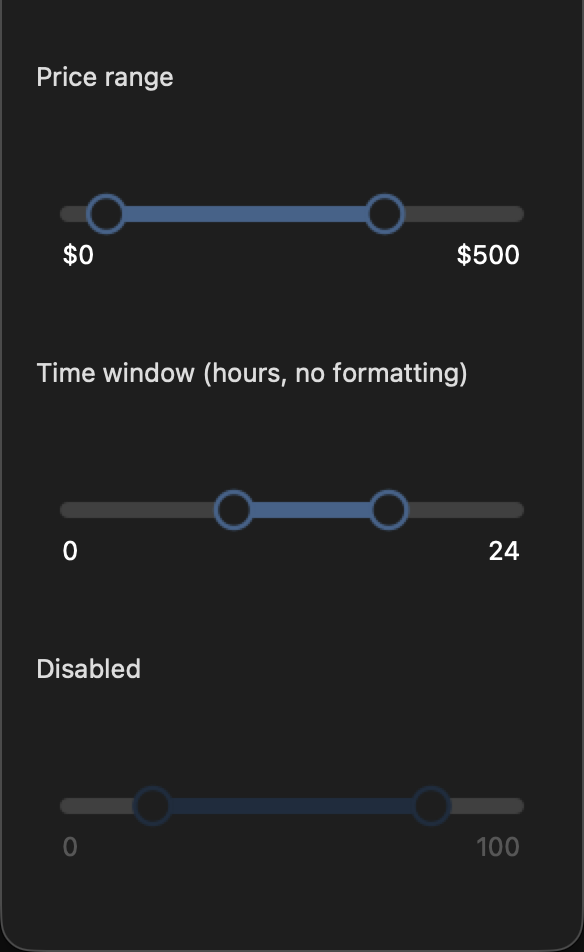

# tryst-range-slider

A dual-thumb range slider for [tryst](../), Crystal's Tcl/Tk binding —
two draggable thumbs bounding a `[low, high]` range on one rounded
track, with an accent-filled segment between them (not from an edge,
unlike a single-thumb slider). Built on `Tryst::OwnerDrawnWidget` and
rendered through [tryst-vector](../tryst-vector/).

```crystal
require "tryst"
require "tryst-range-slider"

app = Tryst::App.new
slider = Tryst::RangeSlider.new(app, min: 0.0, max: 500.0, step: 5.0,
  low: 50.0, high: 350.0, format: ->(v : Float64) { "$#{v.round.to_i}" })
slider.pack(fill: "x", padx: 16, pady: 8)

slider.on_action { |(low, high)| puts "price now $#{low.round.to_i}..$#{high.round.to_i}" }

app.show
app.mainloop
```



*From `examples/range_slider_demo.cr`.*

`#pack`/`#grid` place it, `#low`/`#high` read the current bounds,
`#low=`/`#high=`/`#set_range` set them programmatically, `#on_action`
fires on every user-driven change (drag, click-to-position, or
keyboard) but never for a programmatic set — the same split every
other stateful widget in this codebase draws. Prefer `#set_range` over
calling `#low=` and `#high=` separately when moving both bounds at
once: setting them one at a time clamps the new value against the
*other* thumb's still-old position, which can give a surprising result
when shifting the whole window (e.g. `[10, 20]` to `[40, 60]`) rather
than just narrowing or widening it.

The two thumbs can never cross. `min_gap:` (defaults to `step:`) is how
close they're allowed to get — dragging or nudging one past the other
just stops it `min_gap` away rather than swapping which is low and
which is high.

## Keyboard

Tab to the control, then:

- **Left/Right/Up/Down** — nudge the active thumb by `step`
- **Shift + arrow** — nudge by 10× `step`
- **Home/End** — jump the active thumb to its own bound (`min` for low,
  or as close to `max` as `min_gap` allows; the reverse for high)
- **Tab** — while the low thumb is active, moves to the high thumb
  without leaving the widget; press it again once the high thumb is
  already active to move on to whatever's next

Only one thumb is "active" for the keyboard at a time (shown by the
focus ring) — click either thumb to make it active, or Tab to switch.
This is a deliberate difference from a web `<input type="range">` pair,
which gets one independent Tab stop per thumb: a plain Tk widget is
opaque, so there's no way to lay a second focusable widget over a
thumb without covering the antialiased circle drawn beneath it. One
real Tab stop for the whole control, with an internal active-thumb
pointer, is what actually renders correctly here.

## Requirements

Whatever tryst and tryst-vector need - Crystal >= 1.21.0, Tcl/Tk 8.6,
and ThorVG >= 1.0 (see [tryst-vector's own README](../tryst-vector/) for
per-platform package names and why).

## Examples

Run this **from this directory**, not the repo root — same reason as
tryst-vector's own examples (`require "tryst"` resolves against the
`lib/` of wherever crystal runs).

```
cd tryst-range-slider
crystal run examples/range_slider_demo.cr
```

## Tests

```
shards install
crystal spec                    # host
scripts/docker-test.sh          # Debian forky, same suite
```

`scripts/docker-test.sh` builds from the repo root rather than this
directory, because the `path: ../` dependencies on tryst and
tryst-vector have to be inside the build context; it takes the same
arguments `crystal spec` does, so a focused run works there too.
