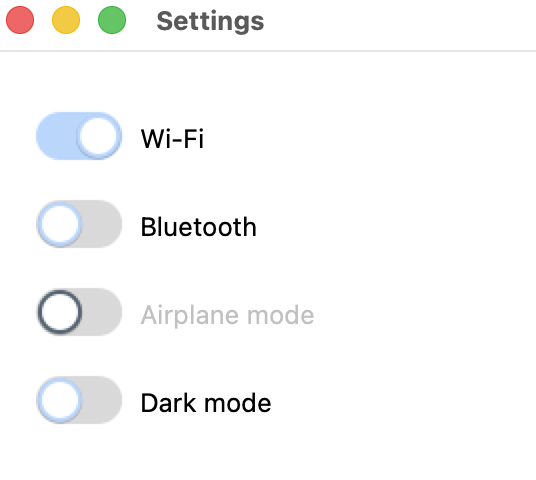

# tryst-switch

A Bootstrap/iOS-style animated on/off switch for [tryst](../), Crystal's
Tcl/Tk binding — a rounded-pill track, an antialiased thumb with a soft
shadow, a ~120ms eased slide plus a track color crossfade on toggle.
Built on `Tryst::OwnerDrawnWidget` and rendered through
[tryst-vector](../tryst-vector/) — the flagship "this is what a custom
widget looks like in tryst" showcase (see
[CUSTOM_WIDGETS.md](../CUSTOM_WIDGETS.md) if you're building your own
rather than just using this one).

```crystal
require "tryst"
require "tryst-switch"

app = Tryst::App.new
switch = Tryst::Switch.new(app, value: true, text: "Dark mode")
switch.pack(padx: 16, pady: 8)

switch.on_action { |on| puts "switch is now #{on ? "on" : "off"}" }

app.show
app.mainloop
```



*From `examples/switch_demo.cr` — run it yourself to see the slide and
crossfade.*

It's just a widget: `#pack`/`#grid` place it, `#value`/`#value=` read
and set it (animating either way), `#on_action` fires only on a
user-driven toggle (click, Space, or Return while focused) — never for
a programmatic `#value=`, the same split `tryst-value-slider`'s own
`#on_change` draws. Nothing about it being canvas-backed or
ThorVG-rendered is part of its own public surface.

There is no `ui.switch`/DSL `bind:` — a stateful, animated widget like
this one doesn't fit a registered `WidgetType`'s narrow `AppContract`
(see `CUSTOM_WIDGETS.md`). A caller wanting two-way sync with a
`Tryst::UI::Var` wires it manually, same as `tryst-value-slider`'s own
README documents:

```crystal
switch.on_action { |v| var.value = v }
var.on_change { |v| switch.value = v }
```

`size:` is the one sizing knob (logical pixels, track height — track
width and thumb radius both derive from it). `text:`/`label_side:`
(`:leading` or `:trailing`) add an optional real Tk label beside the
pill — `tryst-vector` doesn't expose text yet (see its own README), so
the label is a real widget positioned with `place`, not drawn into the
Surface. `accent:` overrides the theme-derived on-color with a
`#rrggbb` hex string, same convention as `tryst-value-slider`/
`tryst-spinner`'s own `accent:`. `disabled_dim:` (default `0.45`, must
be in `[0.0, 1.0]`) controls how much the accent/track dim when
`#disabled?` is true — the one knob this widget exposes beyond its
siblings, for a caller that wants a different disabled look than the
default.

Interaction is click and keyboard (Space/Return while focused) only —
no drag-to-toggle, matching how a real Bootstrap/iOS switch actually
works.

See `examples/switch_demo.cr` for a runnable settings panel: two plain
switches, one disabled, and one whose `#on_action` drives a separate
status label.

## Requirements

Whatever tryst and tryst-vector need — Crystal >= 1.21.0, Tcl/Tk 8.6,
and ThorVG >= 1.0 (see [tryst-vector's own README](../tryst-vector/) for
per-platform package names and why).

## Examples

Run this **from this directory**, not the repo root — same reason as
tryst-vector's own examples (`require "tryst"` resolves against the
`lib/` of wherever crystal runs).

```
cd tryst-switch
crystal run examples/switch_demo.cr
```

## Tests

```
shards install
crystal spec                    # host
scripts/docker-test.sh          # Debian forky, same suite
```

`scripts/docker-test.sh` builds from the repo root rather than this
directory, because the `path: ../` dependencies on tryst and
tryst-vector have to be inside the build context; it takes the same
arguments `crystal spec` does, so a focused run works there too.
